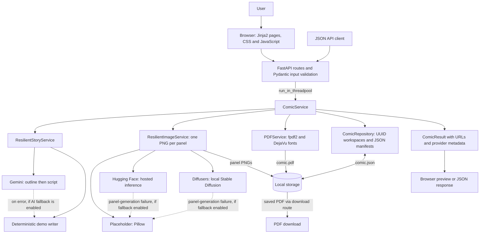
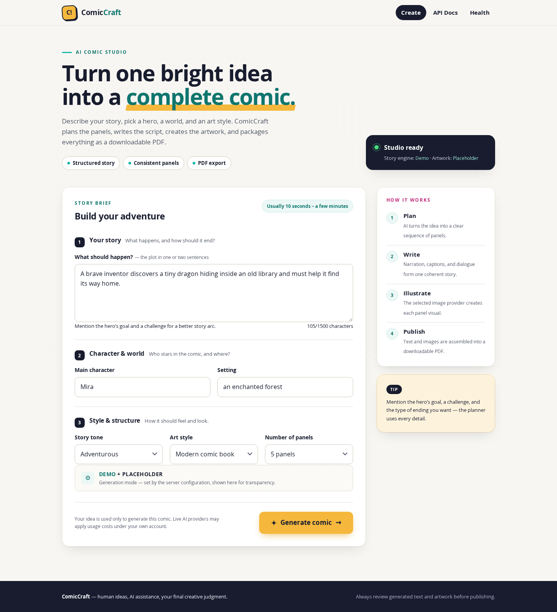
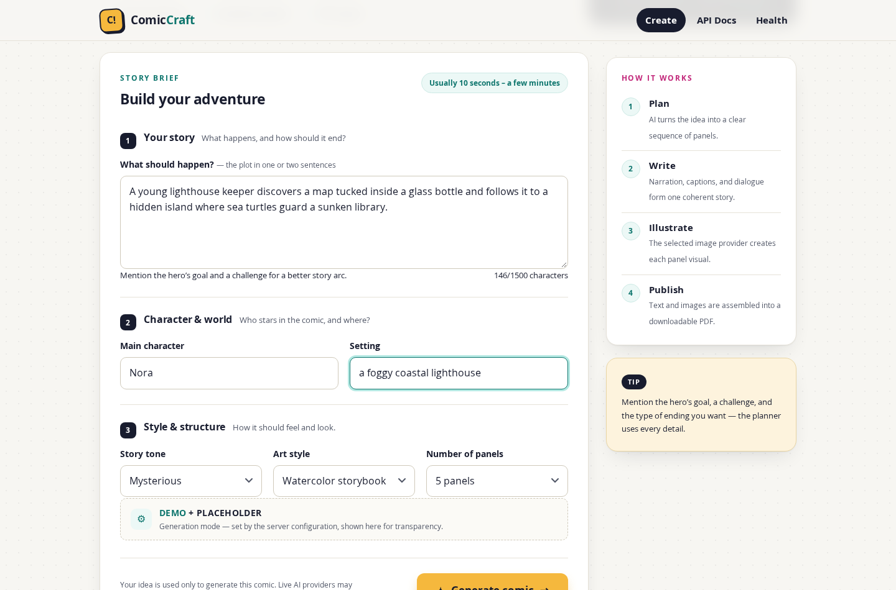
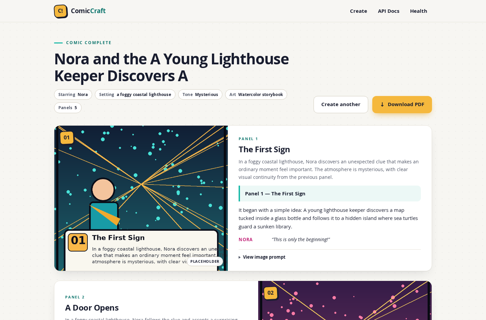

# ComicCraft — AI Comic Story Creator

## Project Overview

ComicCraft is an AI-assisted comic story creation application built with FastAPI. It turns a story idea into a structured comic using the configured two-stage Google Gemini workflow, generates panel artwork through a selectable provider, previews the result in a responsive web UI, and exports a downloadable PDF. An offline, deterministic demo writer and local placeholder artwork also let you try the complete workflow without AI credentials.

The project is based on the supplied ComicCraft documentation but replaces incomplete and fragile snippets with validated, runnable modules.

**Explore:** [Setup](#fastest-setup-no-api-keys) · [Architecture](#system-architecture) · [Screenshots](#application-screenshots) · [API](#api) · [Testing](#testing) · [Project documentation](#project-documentation)

## Problem Statement

Creating a comic manually involves story writing, panel planning, artwork creation, arranging panels, and preparing the final comic output. ComicCraft aims to simplify that workflow by accepting a single creative brief, using AI-assisted story and image generation when configured, and assembling the panel content into a browser preview and PDF. Generated text and artwork still need the creator's review before sharing.

## Objectives

- Convert a story idea and creative preferences into a structured, sequential comic.
- Produce panel-wise scene descriptions, captions, narration, dialogue, and image prompts.
- Generate one image per panel through the configured placeholder, Hugging Face, or local Diffusers provider.
- Provide a browser-based creation form and preview, alongside a JSON API.
- Save comic manifests and artwork so previews and PDF downloads can be reopened by ID.
- Export the comic as a Unicode-capable PDF and report when configured story or image fallbacks are used.

## Features

### Creation and story generation

- Browser form with story, character, setting, tone, style, and 3–8 panels (5 by default)
- Two-stage Gemini workflow: structured outline, then structured comic script
- Strict Pydantic validation instead of splitting free-form AI text
- Offline demo stories for credential-free setup and testing

### Artwork and output

- Three image modes:
  - `placeholder`: fast local demo images; no key or GPU required
  - `huggingface`: hosted text-to-image inference
  - `diffusers`: local Stable Diffusion, loaded only when selected
- Configurable story and per-panel image fallbacks, with warnings in the preview and API metadata
- Responsive Jinja2 frontend with panel text, provider labels, and expandable image prompts
- UUID-isolated output folders and reusable JSON manifests
- Unicode-capable PDF export using bundled DejaVu fonts

### Developer tooling

- JSON API and interactive OpenAPI documentation
- Automated tests, Docker files, cleanup utility, setup scripts, and VS Code configuration

## Technology Stack

| Layer | Technology | Repository reference |
|---|---|---|
| Language | Python 3.11+ | [pyproject.toml](pyproject.toml) |
| Backend and forms | FastAPI, Uvicorn, python-multipart | [requirements.txt](requirements.txt), [routes.py](app/routes.py) |
| Validation and configuration | Pydantic v2, pydantic-settings | [schemas.py](app/schemas.py), [config.py](app/config.py) |
| Templates | Jinja2 | [templates/](app/templates/) |
| Frontend | HTML, CSS, vanilla JavaScript | [static/](app/static/), [templates/](app/templates/) |
| AI story generation | Google Gemini via google-genai; offline demo writer | [llm.py](app/services/llm.py) |
| Image generation | Pillow placeholders; huggingface-hub hosted inference; optional Diffusers/PyTorch | [images.py](app/services/images.py), [requirements.txt](requirements.txt) |
| Optional local diffusion dependencies | torch, diffusers, transformers, accelerate, safetensors | [requirements-local-diffusion.txt](requirements-local-diffusion.txt) |
| PDF export | fpdf2 with bundled DejaVu Sans fonts | [pdf_service.py](app/services/pdf_service.py), [fonts/](app/static/fonts/) |
| Storage | Local filesystem: JSON manifests, PNG panels, PDF files | [repository.py](app/services/repository.py) |
| API documentation | FastAPI-generated OpenAPI and Swagger UI | [main.py](app/main.py) |
| Testing | pytest, pytest-cov, FastAPI TestClient / HTTPX | [requirements-dev.txt](requirements-dev.txt), [tests/](tests/) |
| Linting | Ruff | [pyproject.toml](pyproject.toml) |
| Container packaging | Docker, Docker Compose | [Dockerfile](Dockerfile), [docker-compose.yml](docker-compose.yml) |

## System Architecture



The web form and JSON endpoints share the same [ComicService](app/services/comic_service.py). It creates a workspace, obtains a validated script, generates images sequentially, builds the PDF, and saves the result manifest **before** returning the preview or JSON response. Blocking generation runs in FastAPI's thread pool, but the request waits for completion; there is no background job queue. Saved previews and downloads are loaded through `ComicRepository`, and `/media` serves generated panel images.

## How It Works

1. **Enter a brief:** provide a story idea (10–1500 characters), character, setting, tone, art style, and 3–8 panels in the browser form or JSON request.
2. **Generate the story:** the configured story service uses Gemini's outline/script stages or the deterministic demo writer. Panel count and numbering are validated.
3. **Process each panel:** the script supplies scene text, captions, narration, dialogue, and an image prompt. The image service derives a seed from the comic ID, panel number, and image prompt, then saves a PNG using the selected provider.
4. **Assemble and save:** `PDFService` builds the PDF from the script and images; `ComicRepository` saves a JSON manifest beside the artwork and PDF.
5. **Preview:** inspect panel artwork and text, expand image prompts, and review actual provider names and any fallback warnings. Reopen a saved comic at `/comics/{comic_id}`.
6. **Download:** select **Download PDF** to retrieve the already-built file. With JavaScript enabled, the preview then navigates to the export-confirmation page.

## AI Workflow

The live workflow in [app/services/llm.py](app/services/llm.py) has two stages:

1. **Outline:** the configured `GEMINI_OUTLINE_MODEL` receives the validated brief and requests JSON containing a title, a stable character description (`character_bible`), and panel entries with scene descriptions and image prompts. `ComicOutline` validates the response, exact panel count, and sequential numbering.
2. **Script:** `GEMINI_STORY_MODEL` receives the brief and validated outline, then expands each panel into caption, narration, dialogue, and an image prompt. `ComicScript` validates the response and checks its panel count and sequence against the request.

Both calls use `response_mime_type="application/json"`; responses are normalized and parsed with Pydantic rather than split as free-form prose. Prompts ask for repeated character traits and no written dialogue inside the artwork; these are generation instructions, not guarantees of visual consistency or content safety. The script then feeds the separate image, preview, and PDF pipeline.

### Mode selection and fallback behavior

- `AI_MODE=auto` chooses Gemini when `GEMINI_API_KEY` is non-empty; otherwise it chooses demo mode. `AI_MODE=demo` explicitly avoids Gemini calls, while `AI_MODE=gemini` selects the live workflow.
- The demo writer builds a `ComicScript` directly from fixed story beats and the supplied preferences. It does **not** call an AI model or execute the two Gemini stages.
- Gemini retries recognized transient failures (429, 500, 502, 503, 504 and matching transient error messages) with bounded exponential backoff and jitter. It tries configured fallback models after failed calls and moves directly to the next model for 400/404-style errors.
- If Gemini initialization, generation, or output validation fails, `ALLOW_AI_FALLBACK=true` permits a demo story with a warning and `used_fallback=true`. With it disabled, the error is propagated. Invalid returned JSON is validated after the API call; it is not itself retried through the model list.
- `provider_info` records the actual outline/story models and image providers. A successful switch between Gemini models is reflected in the model names but does not itself set `used_fallback`; that flag covers the demo-story or placeholder-image fallback.

## Project structure

```text
ComicCraft/
├── app/
│   ├── main.py                 # FastAPI factory and middleware
│   ├── routes.py               # Web and JSON routes
│   ├── config.py               # .env configuration
│   ├── schemas.py              # Request, AI-output, and response schemas
│   ├── exceptions.py
│   ├── dependencies.py
│   ├── services/
│   │   ├── comic_service.py    # End-to-end orchestration
│   │   ├── llm.py              # Gemini and demo story providers
│   │   ├── images.py           # Placeholder, HF, and Diffusers providers
│   │   ├── pdf_service.py      # PDF layout/export
│   │   └── repository.py       # Safe filesystem storage
│   ├── templates/              # Jinja2 pages
│   └── static/                 # CSS, JS, icon, and PDF fonts
├── tests/
├── scripts/cleanup.py
├── ComicCraft_Phase_Wise_Submission/  # Eight documentation phases (linked below)
├── docs/screenshots/           # Captures from the running application
├── storage/                    # Created at runtime; generated output is ignored
├── .vscode/                    # Editor, launch, task, and test settings
├── .env.example
├── pyproject.toml
├── requirements*.txt
├── Dockerfile
├── docker-compose.yml
├── setup.sh / setup.bat
├── run.sh / run.bat
├── android-setup.sh / android-run.sh
├── ANDROID-SPCK.md
├── QUICKSTART.md
└── PROJECT_ANALYSIS.md
```

## Fastest setup: no API keys

### Requirements

- Python 3.11 or newer
- About 250 MB for the normal Python environment
- More storage/GPU memory only if using local Stable Diffusion

### Windows

```bat
setup.bat
run.bat
```

### macOS or Linux

```bash
chmod +x setup.sh run.sh
./setup.sh
./run.sh
```

Open <http://127.0.0.1:8000>. `IMAGE_PROVIDER=placeholder` creates local demo panel art, and `AI_MODE=auto` selects the offline demo writer when no Gemini key is set.

> **Note:** the setup scripts copy `.env.example`, which ships with the literal value `GEMINI_API_KEY=your_gemini_api_key_here`. Because that value is not empty, `AI_MODE=auto` resolves to Gemini and calls fail against the placeholder key. For a genuinely credential-free run, either clear the key or set `AI_MODE=demo` in `.env`. `/health` and the home page status card both report the resolved mode.

### Manual installation

```bash
python -m venv .venv

# Windows
.venv\Scripts\activate

# macOS/Linux
source .venv/bin/activate

python -m pip install --upgrade pip
pip install -r requirements-dev.txt
cp .env.example .env          # Windows: copy .env.example .env
uvicorn app.main:app --host 0.0.0.0 --port 8000 --reload
```

## Editor setup

### VS Code

1. Open the `ComicCraft` folder, not its parent folder.
2. Install the recommended Python, Pylance, Ruff, and Docker extensions when prompted.
3. Run `setup.bat` on Windows or `./setup.sh` on macOS/Linux.
4. Select the interpreter inside `.venv` if VS Code does not select it automatically.
5. Press **F5** and choose **ComicCraft: FastAPI**, or run the **Run ComicCraft** task.
6. Run tests from the Testing sidebar or with `python -m pytest`.

The included `.vscode` folder contains launch, task, test, and formatting settings.

### Spck Editor on Android

Spck edits the files, while Termux runs the Python/FastAPI server. Extract the project to `Internal storage/Documents/ComicCraft`, open that folder in Spck, and run these commands in Termux:

```bash
termux-setup-storage
pkg update -y
pkg install -y python python-pillow git rust clang make pkg-config libjpeg-turbo libpng freetype
cd ~/storage/shared/Documents/ComicCraft
bash android-setup.sh
bash android-run.sh
```

Open <http://127.0.0.1:8000> in the Android browser. The mobile script keeps the virtual environment under Termux's home directory because shared storage is not a reliable place for executable virtual-environment files.

Use demo/placeholder mode first. Local Diffusers is not practical on most phones. See **`ANDROID-SPCK.md`** for live Gemini setup, hosted AI images, testing, restarting, and troubleshooting.

## Live Gemini story generation

1. Create a Gemini API key in Google AI Studio.
2. Edit `.env`:

```dotenv
AI_MODE=gemini
GEMINI_API_KEY=your_real_key
GEMINI_OUTLINE_MODEL=gemini-3.5-flash-lite
GEMINI_STORY_MODEL=gemini-3.5-flash
GEMINI_OUTLINE_FALLBACK_MODELS=gemini-flash-lite-latest,gemini-3.5-flash
GEMINI_STORY_FALLBACK_MODELS=gemini-flash-latest,gemini-3.6-flash
GEMINI_RETRY_ATTEMPTS=3
GEMINI_RETRY_BASE_SECONDS=1.5
GEMINI_RETRY_MAX_SECONDS=8
ALLOW_AI_FALLBACK=true
```

3. Restart the server.

The Gemini client now retries transient 429/5xx failures with exponential backoff, switches to configured fallback models, and finally falls back to the deterministic demo story when `ALLOW_AI_FALLBACK=true`. Model availability, free-tier access, and pricing vary by account. Never commit `.env`.

## AI image choices

### A. Placeholder art — default and free

```dotenv
IMAGE_PROVIDER=placeholder
```

This is deterministic local artwork intended for setup, testing, and API demos. It is not presented as model-generated imagery.

### B. Hugging Face hosted generation

```dotenv
IMAGE_PROVIDER=huggingface
HF_TOKEN=hf_your_token
HF_MODEL=stabilityai/stable-diffusion-xl-base-1.0
HF_PROVIDER=
ALLOW_IMAGE_FALLBACK=true
```

The `huggingface_hub.InferenceClient.text_to_image` API is used. Set `HF_PROVIDER` only when your routed provider requires it. Model/provider availability and billing depend on your account. When fallback is enabled, failed panels become labeled placeholder images rather than losing the whole comic.

### C. Local Stable Diffusion

Install the normal requirements first. For NVIDIA, install the correct PyTorch build from <https://pytorch.org/get-started/locally/>, then run:

```bash
pip install -r requirements-local-diffusion.txt
```

Configure:

```dotenv
IMAGE_PROVIDER=diffusers
LOCAL_SD_MODEL=stable-diffusion-v1-5/stable-diffusion-v1-5
LOCAL_SD_DEVICE=auto
LOCAL_SD_STEPS=25
```

The first generation downloads model weights and can require several GB. A supported GPU is strongly recommended.

## Application Screenshots

Captured from the running application in its default `AI_MODE=demo` + `IMAGE_PROVIDER=placeholder` configuration, using a five-panel example brief. No API keys, tokens, or `.env` contents appear in these captures.

### Comic Creation Interface

The home page groups the brief into numbered sections — **Your story** (with a live character counter), **Character &amp; world**, and **Style &amp; structure** — next to a "How it works" rail. The status card and the generation-mode box report the resolved providers.



The same form filled in with an example brief before submitting:



### Generation Progress

After selecting **Generate comic**, a progress overlay confirms the request is running: it shows the current pipeline phase (Plan, Write, Illustrate, Package), rotating status messages, and a reminder to keep the tab open. Demo providers finish in a few seconds; live AI providers keep this overlay visible for longer.


### Generated Comic

The preview page after generation: the comic title, the creative brief as chips (character, setting, tone, art style, panel count), the **Create another** and **Download PDF** actions, and the first panel.



### Generated Comic Panels

Each panel card pairs the generated artwork with its scene description, caption, narration, and dialogue, alternating sides down the page. Panel numbers and the `PLACEHOLDER` chip mark the image provider that actually produced each panel, and the image prompt can be expanded per panel.


The same preview at phone width: panels collapse to a single column and the actions go full width.


### PDF Export

The export confirmation page reached after selecting **Download PDF**, which offers the file again and links back to the preview.


Pages from the actual downloaded PDF for the comic above — the cover and one panel page:


Panel artwork in these captures comes from the deterministic placeholder provider, not an image model. Screenshots of live Gemini stories or hosted Hugging Face artwork are not included, because no provider credentials were available.

## API

Interactive documentation: <http://127.0.0.1:8000/docs>

### Create a comic

```bash
curl -X POST http://127.0.0.1:8000/api/v1/comics \
  -H "Content-Type: application/json" \
  -d '{
    "story_prompt": "A brave fox follows glowing leaves to a hidden city.",
    "character_name": "Ember",
    "setting": "an enchanted forest",
    "tone": "Adventurous",
    "art_style": "Modern comic book",
    "panel_count": 5
  }'
```

The documentation-compatible `POST /generate-comic/json` route is also available. It accepts the legacy aliases `prompt` and `style`.

### Other routes

| Method | Route | Purpose |
|---|---|---|
| GET | `/` | Creation form |
| POST | `/generate` | Browser form generation |
| GET | `/comics/{id}` | Reopen a saved preview |
| GET | `/download/{id}` | Download PDF |
| GET | `/export-success?comic_id=...` | Export confirmation |
| POST | `/api/v1/comics` | Create comic as JSON |
| GET | `/api/v1/comics/{id}` | Read comic manifest |
| GET | `/test-image?prompt=...` | Test selected image provider |
| GET | `/health` | Health/configuration summary |

## Testing

All tests force demo + placeholder mode and never call paid services:

```bash
source .venv/bin/activate       # Windows: .venv\Scripts\activate
python -m pytest
python -m pytest --cov=app
```

The suite in [tests/](tests/) covers the health and home routes, the browser form flow, the JSON API lifecycle including PDF download, input validation and unknown-ID handling, the `/test-image` route, the demo story structure, and the Gemini retry/model-switch policy using a fake client.

Manual checks:

1. Open `/health`; status should be `ok`.
2. Create a three-panel comic from the web form.
3. Confirm each panel image loads.
4. Download the PDF and inspect all pages.
5. Open `/docs` and call `POST /api/v1/comics`.
6. With live providers enabled, inspect `provider_info` for fallbacks/warnings.

## PDF Export

[PDFService](app/services/pdf_service.py) builds the PDF during generation, before the preview appears, so **Download PDF** serves an already-saved file rather than starting a new export. Each document is A4 and contains:

- A cover page with the comic title, the starring character, tone, art style, the original story idea, and a reminder to review generated content.
- One page per panel with the panel title, the artwork scaled to fit a 180 × 145 mm box while preserving its aspect ratio, then the caption, narration, and any dialogue lines.
- A `ComicCraft • Page N` footer, with text set in the bundled DejaVu fonts so Unicode characters render correctly.

Export requires one image per panel; the download filename is derived from the comic title. The same PDF stays available at `/download/{comic_id}` as long as the stored workspace exists.

## Project Documentation

The repository includes phase-wise project documentation under [`ComicCraft_Phase_Wise_Submission/`](ComicCraft_Phase_Wise_Submission/), organized into eight folders:

| # | Phase folder | Included files |
|---|---|---|
| 1 | [Brainstorming & Ideation](ComicCraft_Phase_Wise_Submission/01_Brainstorming_Ideation/) | Phase document |
| 2 | [Requirement Analysis](ComicCraft_Phase_Wise_Submission/02_Requirement_Analysis/) | Phase document |
| 3 | [Project Design](ComicCraft_Phase_Wise_Submission/03_Project_Design/) | Phase document and six diagrams (architecture, workflow, data flow, use case, AI generation flow, fallback flow) |
| 4 | [Project Planning](ComicCraft_Phase_Wise_Submission/04_Project_Planning/) | Phase document and a Gantt chart spreadsheet |
| 5 | [Project Development](ComicCraft_Phase_Wise_Submission/05_Project_Development/) | Phase document |
| 6 | [Project Testing](ComicCraft_Phase_Wise_Submission/06_Project_Testing/) | Phase document, test-case spreadsheet, and requirement traceability matrix |
| 7 | [Project Documentation](ComicCraft_Phase_Wise_Submission/07_Project_Documentation/) | Final project report |
| 8 | [Project Demonstration](ComicCraft_Phase_Wise_Submission/08_Project_Demonstration/) | Demonstration guide, final presentation, and viva questions |

An additional standalone project report (supplementary to the phase-wise documentation above) is available at [docs/additional-documentation/ComicCraft_Project_Documentation.docx](docs/additional-documentation/ComicCraft_Project_Documentation.docx).

For engineering-focused notes, see [PROJECT_ANALYSIS.md](PROJECT_ANALYSIS.md), [QUICKSTART.md](QUICKSTART.md), and [ANDROID-SPCK.md](ANDROID-SPCK.md).

## Project Demonstration

Demo video link will be added here.

A demonstration can follow the workflow this repository actually supports:

1. Introduce the project and the problem it addresses.
2. Show the resolved configuration at `/health` and on the home page status card.
3. Fill in the creation form with a story idea, character, setting, tone, art style, and panel count.
4. Explain the story generation step — the two-stage Gemini workflow when configured, or the offline demo writer.
5. Show the generated panels with their artwork, text, and provider labels.
6. Walk through the preview, including image prompts and any fallback warnings.
7. Download the PDF and show the cover and panel pages.
8. Optionally call `POST /api/v1/comics` to show the same pipeline through the JSON API.

## Docker

```bash
cp .env.example .env
docker compose up --build
```

Generated files persist in `./storage`. The default compose configuration uses demo/placeholder mode unless `.env` enables providers.

## Output and cleanup

Every comic is stored at:

```text
storage/comics/<comic-id>/
├── comic.json
├── comic.pdf
└── panels/
```

Remove old output:

```bash
python scripts/cleanup.py --days 7 --dry-run
python scripts/cleanup.py --days 7
```

## Troubleshooting

- **Gemini 401/403:** verify the key, account, region, and model access.
- **Gemini model not found:** update the two model IDs in `.env`.
- **Hugging Face 401/402/503:** verify token, provider, model access, credits, and timeout.
- **Local model is extremely slow:** use a CUDA GPU, lower image size/steps, or select hosted/placeholder mode.
- **Port already used:** run `uvicorn app.main:app --port 8001`.
- **Old `fpdf` conflict:** run `pip uninstall -y fpdf && pip install --force-reinstall fpdf2`.
- **Generated output consumes disk:** use `scripts/cleanup.py` regularly.

## Production checklist

Before exposing this app publicly, add authentication, per-user quotas, rate limiting, a background task queue, a database, object storage, HTTPS, provider cost budgets, audience-appropriate moderation, monitoring, and scheduled cleanup. The current synchronous generation route is intentionally simple and is best for learning or controlled use.

See `PROJECT_ANALYSIS.md` for the documentation review and design decisions.

## Limitations

These reflect the current implementation:

- Generation is synchronous within the request. There is no background queue or progress API, so a browser or client waits for the whole pipeline; live image providers can take minutes.
- Panel count is limited to 3–8 per comic, and story prompts to 1500 characters.
- The application has no authentication, quotas, or rate limiting, and no content moderation beyond prompt wording and input validation.
- Storage is the local filesystem only. There is no database or object storage, and old comics accumulate until `scripts/cleanup.py` removes them.
- Application state lives in a single process, so it is not designed for multi-worker deployment.
- Placeholder artwork is deterministic local drawing, not model-generated imagery. Live story and image generation require your own Gemini key or Hugging Face token, and local Diffusers needs a large model download and ideally a GPU.
- Image fallback covers per-panel generation failures. A missing or invalid Hugging Face token raises a configuration error at provider construction instead of falling back to placeholder art.
- The interface is English-only, with no internationalization support.

## Future Enhancements

These are **possible future work**, not existing features:

- Additional image-generation providers and model options.
- More customization, such as editing the outline before artwork is generated, or regenerating a single panel.
- Additional comic layouts and page templates, including multi-panel pages.
- Improved panel editing, such as adjusting captions or dialogue after generation.
- Background job processing with progress reporting for long generations.
- The hardening steps listed in the production checklist above.

## License

Application code: MIT. Bundled DejaVu fonts retain their own license in `app/static/fonts/LICENSE-DejaVu.txt`.
